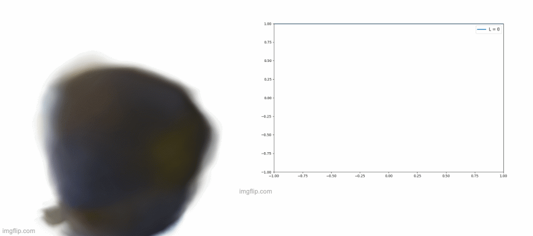

# NeRF Explainability


[NeRF](http://www.matthewtancik.com/nerf) (Neural Radiance Fields) is a method that achieves state-of-the-art results for synthesizing novel views of complex scenes. Here are some videos generated by this repository (pre-trained models are provided below):


NeRF encodes the 3D scene information in the weights of the coordinate based MLP. This project aims to understand how and where is the 3D scene information encoded in the neural network. To this end, various experiments are carried out to see how the rendered scenes vary when modifying the NeRF MLP or the inputs.

## Results

### 1. Analysing the Frequency Bands

NeRF is a model that ouputs color and occupancy for given 3D point and a camera angle. However, NeRF doesn't directly pass in the point and camera angle coordinates. Rather, they are encoded into fourier features via sampling from sine and cosine functions at x, y, z and camera angles $\gamma(x) = [\cos(2^{L - 1} * x), \sin(2^{L - 1} * x)]$. Pleasre, Refer to the paper for more details. For the input coordinate, the paper uses embeddings of up to `L = 10` while for camera angle they use only `L = 4`.  

One interesting question to ask is what do these bands represent. By increasing or decreasing the maximal band we can get some ideas about it.

Here, the maximal band for camera angle is shrinked and expanded. As it can be seen, the lighting effects in the room change. Even though the input angle is the same, NeRF renders the image as if it is viewed from some other angle. This is also documented in the paper. 


Here, the maximal band for 3D points is shrinked and expanded. The resulting scene expands when the maximal band is lowered. It is just like expanding a spring. Quite the opposite happens the the maximal band is increased. The scene shrinks as if it is being squeezed. It is like squeezing a spring.  

You can also see how the details are being lost when the max frequency band is decreases. It is logical since we are effectively losing higher frequency ebeddings. When the max frequency band is increased, there is notable aliasing and noise as we make embeddings use higher frequencies. Also, due to the periodic nature of the embeddigs, you can see how particles of the object start to appear from the boundaries of the image.



## Installation

For installation, please follow the README in the main folder.

## How To Run?

### Quick Start

Download data for two example datasets: `lego` and `fern` running the following command. Then download pre-trained NeRF models

You can download the pre-trained models [here](https://drive.google.com/drive/folders/1jIr8dkvefrQmv737fFm2isiT6tqpbTbv). Place the downloaded models somewhoere in the `./nerf_explainability/models` folder. You will be able to specify the path to the models in the config file. So, it is not entirely important where you place them

```
├── models 
│   ├── fern
│       ├── model.tar  # downloaded model
```

Create a `config.ini` file in `./nerf_explainability/config` folder. For structure, please follow other examples in the same folder. There, you will be able to specify the model and rendering parameters as well as the dataset to be loaded. To find out exact parameters necessary for your dataset, please head over to [here](https://drive.google.com/drive/folders/128yBriW1IG_3NJ5Rp7APSTZsJqdJdfc1). This part involves some trial and error, Good luck.

### Rendering

WIP: At the moment, you can run `python ./nerf_explainability/nerf_extractor/nerf_pry.py` to render a scene.

## Components

At the heart of this explainability project is the `NeRFExtractor` class in `./nerf_explainability/nerf_extractor/nerf_pry.py`. It allows the user to access the weights of the NeRF models with an easy to use API. Also, it allows to registed `forward` and `pre_forward` hooks to the layers of the model by specifying the functions and the layer names. For examples

```python
hooks = [
  {"type": "fine", "layer_name": "rgb_linear", "hook_type": "pre_forward", "hook": lambda m, i: print(f"here we are in {m}")},
  {"type": "coarse", "layer_name": "rgb_linear", "hook_type": "forward", "hook": lambda m, i, o: print(f"here we are in {m}")}
]
handles = nerf_extractor.register_hooks(hooks)
```

## Method

[NeRF: Representing Scenes as Neural Radiance Fields for View Synthesis](http://tancik.com/nerf)  
 [Ben Mildenhall](https://people.eecs.berkeley.edu/~bmild/)\*<sup>1</sup>,
 [Pratul P. Srinivasan](https://people.eecs.berkeley.edu/~pratul/)\*<sup>1</sup>,
 [Matthew Tancik](http://tancik.com/)\*<sup>1</sup>,
 [Jonathan T. Barron](http://jonbarron.info/)<sup>2</sup>,
 [Ravi Ramamoorthi](http://cseweb.ucsd.edu/~ravir/)<sup>3</sup>,
 [Ren Ng](https://www2.eecs.berkeley.edu/Faculty/Homepages/yirenng.html)<sup>1</sup> <br>
 <sup>1</sup>UC Berkeley, <sup>2</sup>Google Research, <sup>3</sup>UC San Diego  
  \*denotes equal contribution  
  


> A neural radiance field is a simple fully connected network (weights are ~5MB) trained to reproduce input views of a single scene using a rendering loss. The network directly maps from spatial location and viewing direction (5D input) to color and opacity (4D output), acting as the "volume" so we can use volume rendering to differentiably render new views


## Citation
Kudos to the authors for their amazing results:
```
@misc{mildenhall2020nerf,
    title={NeRF: Representing Scenes as Neural Radiance Fields for View Synthesis},
    author={Ben Mildenhall and Pratul P. Srinivasan and Matthew Tancik and Jonathan T. Barron and Ravi Ramamoorthi and Ren Ng},
    year={2020},
    eprint={2003.08934},
    archivePrefix={arXiv},
    primaryClass={cs.CV}
}
```

However, if you find this implementation or pre-trained models helpful, please consider to cite:
```
@misc{lin2020nerfpytorch,
  title={NeRF-pytorch},
  author={Yen-Chen, Lin},
  publisher = {GitHub},
  journal = {GitHub repository},
  howpublished={\url{https://github.com/yenchenlin/nerf-pytorch/}},
  year={2020}
}
```
